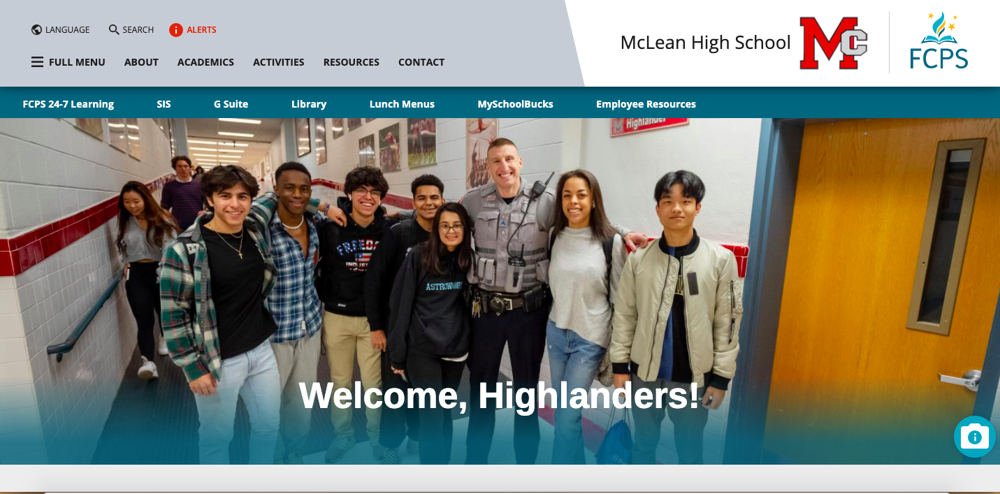
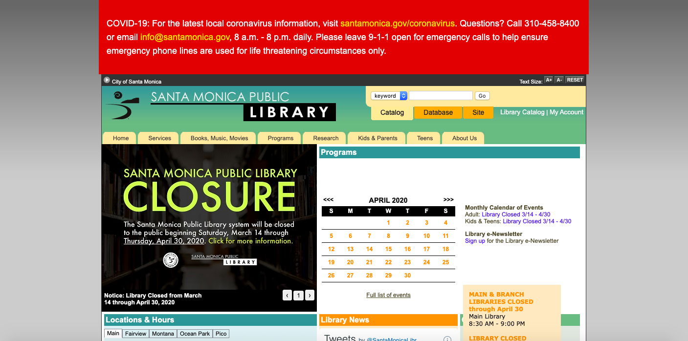
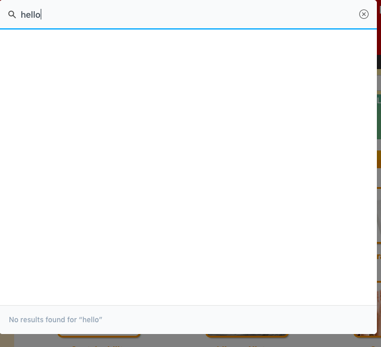
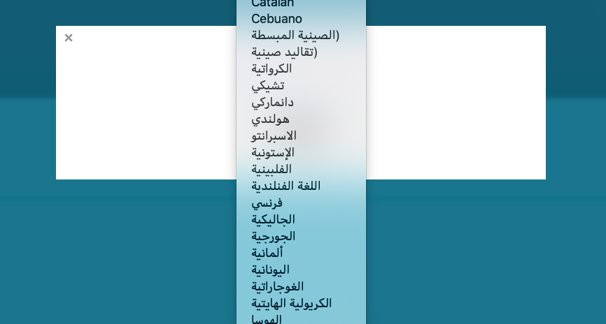

# UX Design of Public Experiences

## DH150 Assignment01: Heuristic Evaluation of "Public" Websites by Avery Edson

### Overall Motivation:

When I think of public entities, the US public education system immediately comes to mind. It's run by state/local governments, funded by community taxpayers, and attended by the nation's youth; it concerns people as a whole. The term itself, "public" education, implies it is made available to all. And so, given the project theme of "public", I have first decided to focus on public education, specifically my own. Thus, the first website I have chosen is the website for the public high school I attended, McLean High School. 

Throughout my life, the public resource I have taken advantage of the most would have to be libraries. Public libraries are accessible by the general public, funded by public sources. They provide the community greatly with information, services, and technology, whether it be for recreational or educational purposes. And so, the second website I have chosen is the website for a public library I have frequented in Los Angeles, the Santa Monica Public Library.

### Website 1: McLean High School (MHS)
https://mcleanhs.fcps.edu/

#### Initial Evaluation:
The site seems to pack in a lot of useful information regarding the school, anticipating many users' queries. In this sense, the site presents a good understanding of what content its users desire, however, there is a great lack of organization. For example, the global navigation menu in the header is quite straightforward, but once you click on it, the site takes you to a new page where the subpages are listed, which then take you to subsquent pages with more subpages. This is tedious to navigate through, and requires the user to maneuver back and forth between pages in search of the desired one. Additionally, there are navigation links on the homepage that seem to be a random assortment of topics. I am assuming such are common links used by the daily user, however, this would certainly confuse a new user. The biggest issue with this site is it lacks the organization/consolidation of information, speficically regarding its subpages, which reduces the its usability. 

### Website 2: Santa Monica Public Library
https://www.smpl.org/

#### Initial Evaluation:
The Santa Monica Public Library website appears to be quite organized with its headers, subpages, and local navigation bars. The header text, however, is too small. It is the same size as the paragraph text within the pages, and so does not convey any sort of structural hierarchy. The catalog is readily available at the top of the page, relaying good UX design as this is generally the first feature users will use when visiting a library site. But again, it is quite small in the top right corner and can be easy for users to miss. Better use of the grey space on either side of the website's body would perhaps reduce crowding, allowing for larger font size. 

### Heuristic Evaluation:

###### severity ratings:(1) - low priority fix, (2), (3) - high priority fix

#### 1: Visibility of system status
##### MHS
+Certain tabs have graphics that will move when hovering over them, informing the user the site is registering their movements.

+The search results state the number of results there are at the top of the page, as well which of them are displayed on the current page. 

+When you scroll down a page, a grey circle with an arrow appears in the bottom right hand corner, allowing the user to click it to return to the top. This indicates to the user they have left the top of the page. It disappears once they return to the top of the page.

-Only some navigation links will be highlighted/indicated when hovering over them. This allows the user to know they may interact with the link, however, consistency is required. __(1)__

-There is no visualization that relays to the user a page is loading. __(1)__
##### Santa Monica Public Library
+/-Most navigation links are dynamic when the user hovers over them. The links are either underlined or highlighted, indicating the system has registered the user's movements. However, this is not consistent throughout the site. __(1)__

+Once the user is on the main catalog search page, there is a load bar at the top that appears when the user enters/modifies their search. This indicates to the user the system has registered the user's inputs.

+The catalog displays dots at the bottom of the selection indicating how many pages there are and which page the user is currently viewing.

-When searching within the catalog off of the homepage, there is nothing signaling to the user that the system has registered/is loading their search. It also takes a couple seconds, and so it would be helpful to have some sort of visibility here. __(2)__

-When using the site's search feature, it is difficult to discern whether the system is still loading or has completed the search when there are no results found. This is because there is a blue bar at the top resembling a loading bar that remains when the search is complete. This suggests to the user that the system is still loading, when in fact the search is completed and no results were found. __(2)__

#### 2: Match between system and the real world
##### MHS

+Familiar icons and infographics contribute to user understanding. 

+Navigation links include common phrases that are clear and concise, improving the user's understanding of what to expect if they click it.

-The "Features" page relays what is going on lately at the school like short news highlights. The term "features" does not accurately represent this. Some headings do not accurately represent the information within the page, and so the user won't know what to expect. __(3)__

-System-oriented terms in the homepage will confuse new users. __(2)__

-Titles of the site and subpages are found on the right side of the page. This is illogical as users are accustomed to reading from left to right. __(2)__
##### Santa Monica Public Library
+The site mostly uses simple, user-friendly language and includes relevant visuals.

-However, there are instances of system-oriented language that a new user will not understand at first glance. __(2)__

-The site offers the option of searching through the catalog, database, or site. What is troublesome here is that the difference between catalog and database may not be apparent to all users and requires clarification. __(2)__

-The subpages are not necessarily grouped logically under each header. For example, the user would not think to find linkes for "Local History" and "Computer Classes" under the header "Research." __(3)__

-The homepage lists the information for the main library adjacent to the information for its branches. Instead of labelling the branch libraries with the actual term "branches," the site simply lists the street names. A new user will be confused as to what these are, and so the site should indicate these are branches of the main library. __(2)__

#### 3: User control and freedom
##### MHS
+The site allows the user to access and exit the search bar without leaving the page they were previously on. 

+The user can edit their search query at the top of the search results.

+The site allows the user to access and exit the "Full Menu" navigation bar without losing the page they were on. The user can also maneuver back and forth between subpage headers in the navigation bar using a back arrow.

-When changing the language, the site changes everything including the language options for changing the language. For example, I changed the language to Arabic and wanted to change it back to English, however, I could not distinguish which language was English in the dropdown list because all the options were written in Arabic. The site does not support undoing a change of language easily. __(3)__

##### Santa Monica Public Library 
+The search function allows users to easily modify their search without having to conduct a whole new search.

+The site provides the option to manipulate the font size of the text. This includes a size increase and decrease button, as well as a reset button.

-When inputting registration information for the library's newsletter, the site does not provide the user with a "Go back" function to edit their input information. __(1)__

-Once the user has completed their subscription, there is no function to allow the user to undo this action. Additionally, if the user wishes to manage their preferences with regard to the subscription, they must open a link sent to their email. This seems uneccesary and should be an action the user can complete within the site. __(1)__

#### 4: Consistency and standards
##### MHS
+Consistent typography.

-Inconsistent page displays for the pages linked in the header navigation bar. __(3)__

-There is a difference in the navigation headings of the main menu displayed on the homepage and of the extended "Full Menu". This could confuse users as to which links lead to which pages. __(3)__

-There is a difference in box colors in the announcements sections, leaving users to wonder whether this has any meaning. __(1)__
##### Santa Monica Public Library
-There are inconsistencies in listing the main library and its branches on the homepage. The first tab reads "Main", and so the other tabs should read "Branches", however, they simply state the street names of the where the branches are located. __(2)__

-Some of the websites local navigation bars will repeat the main header bar at top, whereas some won't. This should be made consistent across the wbesite. __(2)__

-On the homepage, there is a search bar for the catalog at the top right corner. Also at the top right corner, is a navigation link to the library catalog. This is redundant, however, the user will not necessarily know this and they will be left to wonder if there is a difference between the two options. __(1)__

#### 5: Error prevention
##### MHS
+An error message pops up when attempting to submit a contact form with incorrect information.

+The site checks with the user if they are sure they wish to leave the page. This prevents the user from losing any information they might not want tot delete.

-The site does not inform or ask the user if they are sure they wish to leave the McLean High School website when clicking links that redirect to an external site. __(2)__
##### Santa Monica Public Library
+The site provides suggestions dropped down from the search bar based on what the user is typing. This prevents the user from making a typo.

-The site does not ask for confirmation when completing a subscription, along other tasks. __(1)__

-When subscribing to a newsletter, the site does not immediatly recognize when a user inputs an invalid email address. The user must attempt to subscribe, by clicking the button "Subscribe", for the systemt to recognize its invalidity. __(1)__

-The search bar should contain text stating what the user should type in based on what they have selected to search by. For example, if they specified to search by keyword, the search bar should state "Enter a keyword." Often times, I will forget what I am searching by or forget to change what I am searching by before typing in my search, which produces undesired results. __(2)__
#### 6: Recognition rather than recall
##### MHS
+The search bar suggests search options that the user has previously searched, reminding the user what they had searched before.

+When navigating through the site, the header (within the "Full Menu") that the user's current page falls under is highlighted. This allows the user to remember how they navigated the site to reach the page they are on.

-Navigation links don't stay highlighted once the user has visited the linked page, not allowing the user to recognize which pages they have previously visited. __(1)__
##### Santa Monica Public Library
+The search bar suggests search options to the user as they type, allowing the user to recognize a desired book title/author name rather than forcing them to recall.

+The site lists which books the user is borrowing, which they have on hold, and what fees the user owers, so the user does not have to recall from their memory. Additionally, there is a "like option" in the catalog, so users can keep track of books they may be interested in.

-There are no photos of the library on the homepage, the user must travel to the "About Us" tab and then click on "Locations and Hours." The user may not think to do this when they are trying to recognize which of the main or branch libraries they have visited before, and so perhaps this would be helpful to include on the homepage (or closer to it). __(1)__

-The site search function does not produce a drop down list of previous searches, forcing the user to recall what they searched previously to find what they are looking for. __(2)__

#### 7: Flexibility and efficiency of use
##### MHS
+/-On the homepage, there are additional navigation links presented within a subheader. "FCPS 24-7 Learning" is the school system's CCLE, and so I assume these are frequently visited links that are presented on the homepage for quick access. This is convenient for the expert user who understands what these system-oriented terms are. This may, however, confuse inexperienced users who don't understand what these links are. __(2)__
##### Santa Monica Public Library
+The library catalog and databases are made easily accesible in the top right hand corner of the homepage. This is useful to both experienced and inexperienced users.

-The user can only navigate throught the calendar by clicking through each month. To accelerate this process, the site should include a drop down list of months to navigate through. __(2)__

-Within the library catalog, there is no menu with subpages that allow the user to explore genres of books when they don't have a specific book in mind and they would simply like to browse. __(3)__

#### 8: Aesthetic and minimalist design
##### MHS
+Most pages on the site do decent job of including the necessary minimal information, getting straight to the point of what the page is relaying. Not overly text heavy.

-Although most pages aren't overly text heavy, they require reformatting to organize information. This will increase usability as the user will be able to better follow each page. Reformatting will additionally increase aesthetic design. __(3)__

-Design of the entire website can be further minimalized by consolidating information into clear subheadings and by reducing the amount of irrelevant graphics (and also irrelevant captions). __(3)__
##### Santa Monica Public Library 
-The color schemes of header pages are not consistent across. Overuse of colors. __(1)__

-Font sizes are not organized well, they do not convey structural or informational hierarchy. __(3)__

-There are multiple ways/links to access the same pages and information, and so this should be consolidated to minimalize the design. __(3)__

-Unaesthetic grey space on the sides of the body of the website. This is also inconsistent as this space disappears when venturing to the library's catalog. __(3)__
#### 9: Help users recognize, diagnose, and recover from errors
##### MHS
+/-The contact form will display reasons for error when an invalid response is attempted to be submitted. The error message simply states the error for some fields, whereas for others, specifically the "Message" field, the error message states what is wrong and what must be fixed: "Message must be longer than 16 characters but is currently 5 characters long". __(1)__

+The search bar will display suggestions for what to change in the user's query if their original search came up with no results. "Search suggestions: check your spelling, try more general words, and try different words with the same meaning."

##### Santa Monica Public Library 
+When subscribing for the library's newletter, the system informs the user what parts of an email address the user is missing if they enter it incorrectly. 

+/-The system notifies the user when the username/barcode or PIN is incorrect, however, it does not instruct/remind the user of what the barcode or PIN is. This may not be clear to inexperienced users. __(1)__

-The system does not register that numbers are an invalid name. __(1)__

-When conducting an advance search, the system does not terminate the search when the user has input an invalid genre. The system should recognize that the word "hello" is not a genre, yet it continues to conduct its search. __(2)__

#### 10: Help and documentation
##### MHS
+The search bar allows user's to type in own questions, producing fairly helpful results. For example, I searched "how to excuse an absence," and the results guided me to the "Attendance" page with a detailed step-by-step set of instructions of what to do.
##### Santa Monica Public Library
+The site search bar allows users to type in specific questions and seems to mostly direct users to the correct pages.

+The site includes a step-by-step process for how to get a library card.

-There is no "Help" or "FAQ" extension from the homepage itself. The user must know to travel to the library's catalog, where they will find a comprehensive help and documentation forum. __(2)__

