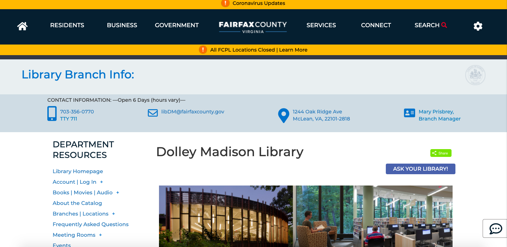

# UX Design of High School Experiences

## DH150 Assignment01: Heuristic Evaluation of "Public" Websites by Avery Edson

### Overall Motivation:

When I think of public entities, the US public education system immediately comes to mind. It's run by state/local governments, funded by community taxpayers, and attended by the nation's youth; it concerns people as a whole. The term itself, "public" education, implies it is made available to all. And so, given the project theme of "public", I have first decided to focus on public education, specifically my own. Thus, the first website I have chosen is the website for the public high school I attended, McLean High School. 

Throughout my life, the public resource I have taken advantage of the most would have to be libraries. Public libraries are accessible by the general public, funded by public sources. They provide the community greatly with information, services, and technology, whether it be for recreational or educational purposes. And so, for this project I will revisit the library I frequented the most while in high school. The second website I have chosen is the website for the Dolley Madison Library.

### Website 1: McLean High School (MHS)
https://mcleanhs.fcps.edu/

#### Initial Evaluation:
The site seems to pack in a lot of useful information regarding the school, anticipating many users' queries. In this sense, the site presents a good understanding of what content its users desire, however, there is a great lack of organization. For example, the global navigation menu in the header is quite straightforward, but once you click on it, the site takes you to a new page where the subpages are listed, which then take you to subsquent pages with more subpages. This is tedious to navigate through, and requires the user to maneuver back and forth between pages in search of the desired one. Additionally, there are navigation links on the homepage that seem to be a random assortment of topics. I am assuming such are common links used by the daily user, however, this would certainly confuse a new user. The biggest issue with this site is it lacks the organization/consolidation of information, speficically regarding its subpages, which reduces user accessibility. 

### Website 2: Dolley Madison Library
https://www.fairfaxcounty.gov/library/branches/dolley-madison

#### Initial Evaluation:

### Heuristic Evaluation:

#### 1: Visibility of system status
##### MHS
##### Dolley Madison 

#### 2: Match between system and the real world
##### MHS
##### Dolley Madison 

#### 3: User control and freedom
##### MHS
##### Dolley Madison 

#### 4: Consistency and standards
##### MHS
##### Dolley Madison 

#### 5: Error prevention
##### MHS
##### Dolley Madison 

#### 6: Recognition rather than recall
##### MHS
##### Dolley Madison 

#### 7: Flexibility and efficiency of use
##### MHS
##### Dolley Madison 

#### 8: Aesthetic and minimalist design
##### MHS
##### Dolley Madison 

#### 9: Help users recognize, diagnose, and recover from errors
##### MHS
##### Dolley Madison 

#### 10: Help and documentation
##### MHS
##### Dolley Madison 

