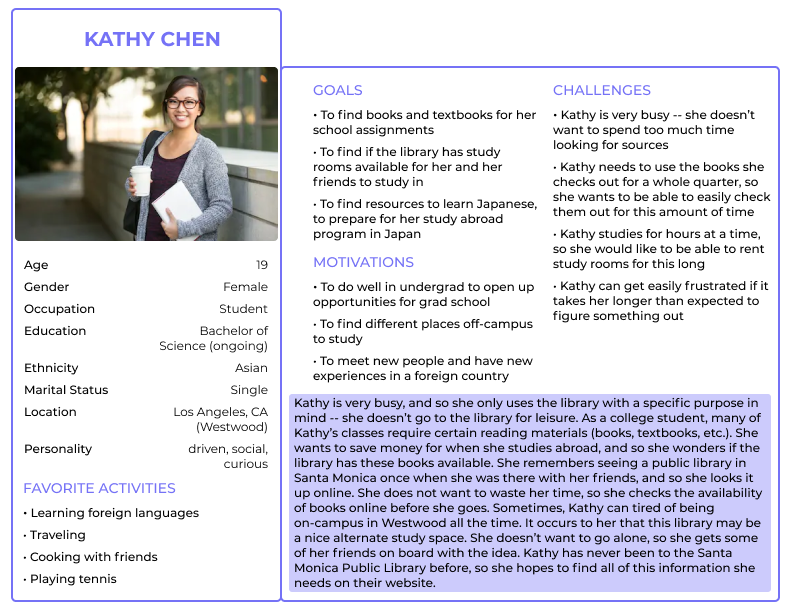
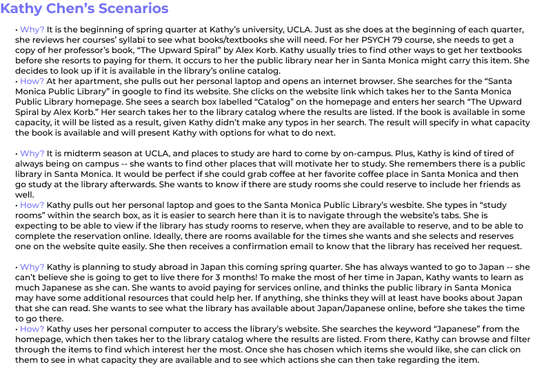
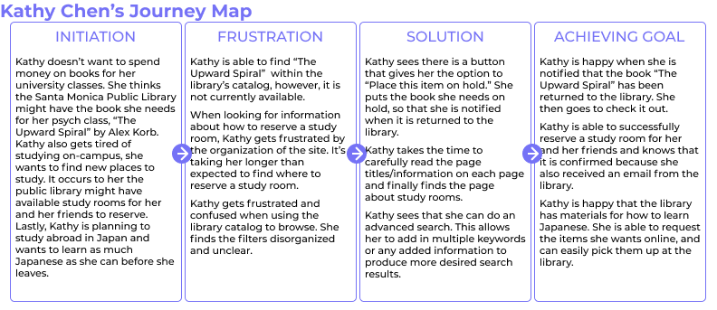
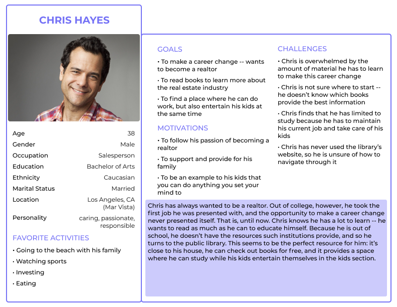
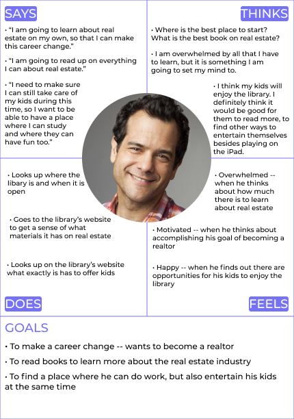
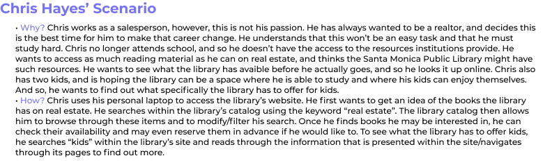
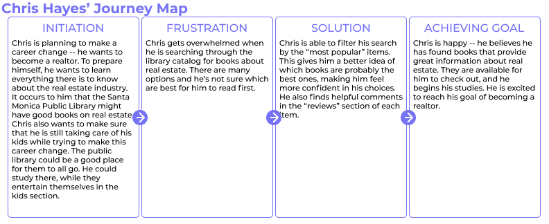
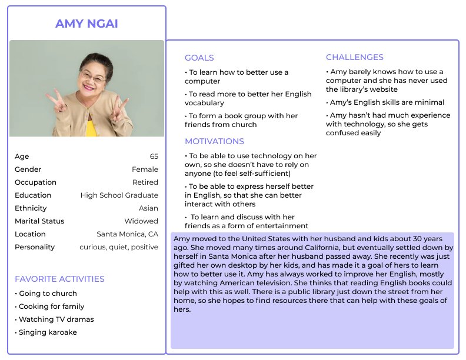
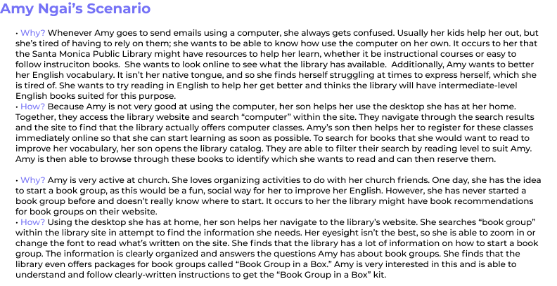
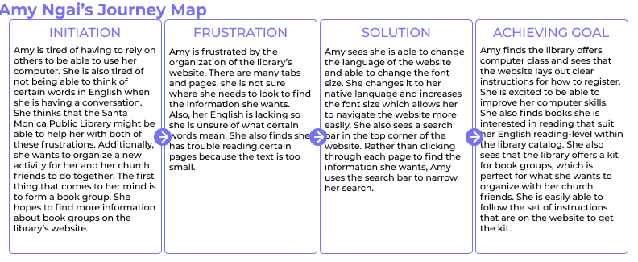

# UX Design of a Public Library Website

## DH150 Assignment05: Persona + Scenario by Avery Edson

### What is the purpose of UX storytelling?

The purpose of UX storytelling is to understand the user; it allows design teams to gain insights into their users’ thoughts, behaviors, actions, and contexts. In addition to this, it allows team to connect quickly, to establish an agreed upon perception of their user, so that they may work effectively to design a cohesive product.

### Key features of design:
1) the library catalog
2) the search function within the library's website
3) the library website's organization of information/page titles

### Kathy Chen

### Chris Hayes

### Amy Ngai

