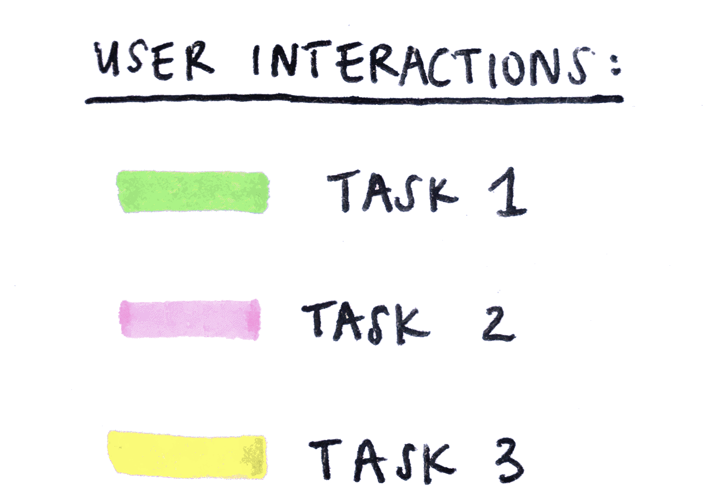

# UX Design of a Public Library Website

## DH150: Assignment06: Low-Fidelity Prototyping by Avery Edson

---

#### Description of project:

For this project, I have chosen to redesign the Santa Monica Public Library website. The Santa Monica Public Library consists of one main library and four additional library branches, all located in Santa Monica, California. Given that it is for the public, the Santa Monica library serves many purposes for a wide range of users. Rather than try to incorporate them all within my redesign, I have chosen to focus on the most used website features across these user groups for the purposes of this project.
Given the current pandemic, it was difficult to conduct extensive user research to properly understand which of the library's website features are the most used. Based on the research I was able to gather and on my own previous experiences, I concluded that many users visit the library website to search within the library's catalog. This is the first feature I will focus on. Many users then visit the website to find out information regarding the library, as in what is its hours, what services does it provide, what programs does it host, etc. I understand this is quite a vague statement, but again, I am trying to encapsulate as many users within my understanding of the website, and it seems most users intend to read information when visiting the website.  Thus, the second feature I will focus on is the organization of information across the website's pages, including their titles and content. Additionally, to find the information they are looking for, many users will defer to a site's search function, rather than exploring each tab. And so, the third aspect I will focus on is the site's search feature.

I created three personas, one based on the user research I conducted and two based on my own perceptions. I understand this is flawed, but again, I was unable to conduct extensive user research given the circumstances. 

The first persona is a young female college student, Kathy Chen. Kathy attends UCLA and is very busy, so she doesn't usually spend much time at public libraries off-campus. Plus, she has many resources available to her through ULCA already. When she does want to use the public library, however, she expects to find out information on its website pretty immediately, especially because she considers herself to be techonologically savvy. 

The second persona is a 38 year old man looking to make a career change, I've named him Chris Hayes. Unlike Kathy, Chris does not have the resources an institution provides, and so the public library proves to be very useful to him. Chris wants to become a realtor, and thus wants to gather as much reading material on real estate as he can so that he can prepare himself for this change. Chris also has two kids. Luckily the Santa Monica Public Library has a kids section; he could complete his studies at the library while still keeping his kids entertained.

The third persona is an elderly woman hoping to gain  computer skills, her name is Amy Ngai. Just like Chris, she doesn't have access to the resources an institution provides. Amy is tired of having to rely on her kids for help when she wants to send an emails, and so she hopes the Santa Monica Public Library will be able to help her with her goals. 

The scenarios I've created for these personas incoporates the features I have chosen to focus on: the library catalog, organization of information within the site, and the site's search function. The scenarios are:

- Kathy wants to reserve a study room for her and her friends, and will maneuver through the website to find information on how to reserve one.
- Chris wants to find the best reading material on real estate, and so will browse within the library's catalog.
- Amy wants to find out whether the library offers computer courses or not, so she searches "computer courses" within the site (or she could also elect to naviagte through the site's tabs to find out this information)

The purpose of this low-fidelity prototyping is to translate the concepts I have for these features into tangible 2D visuals and to test their functionality. I can then go through the iterative process of having users test the low-fidelity prototype and making the necessary revisions, before moving on to high-fidelity prototyping.

---
#### Tasks:
1. Reserve a study room
2. Find a book on real estate
3. Find out information about computer classes

---
#### Wireframes:

#### Wireflow:

#### User interactions:

--- 
### Reflection:
