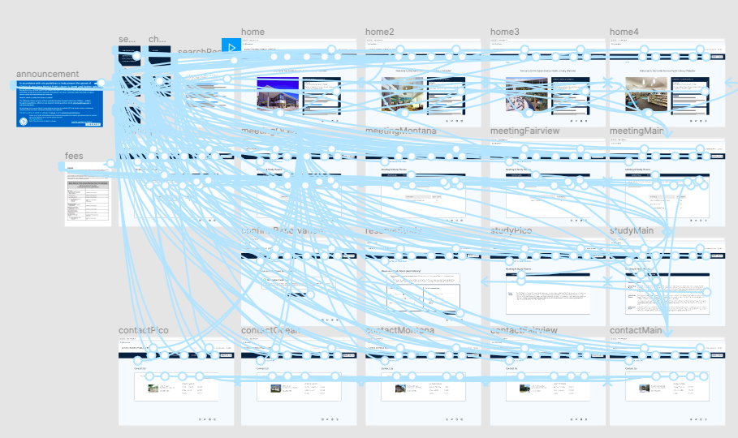
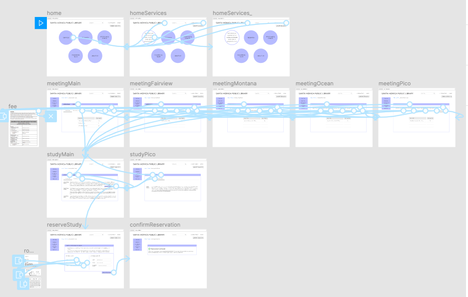
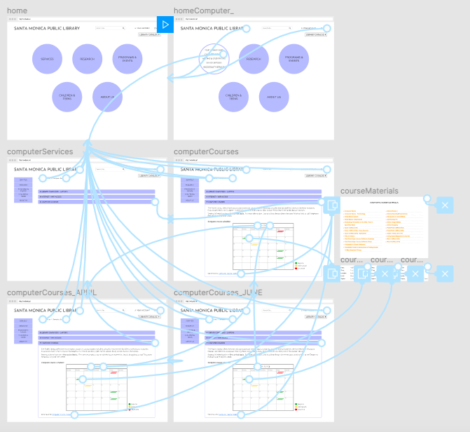
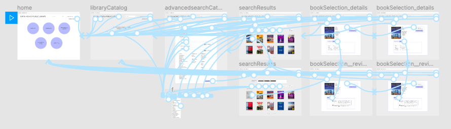

# UX Design of a Public Library Website
## Assignment07: High-Fidelity Prototype 
#### by Avery Edson

### 01 Project Description

The purpose of this project is to develop a human-centered redesign of the Santa Monica Public Library website. Based on my findings from a heuristic evaluation and from user research of the current library website, I have drafted my own design. The high-fidelity prototype allows me to tangibly realize my designs, as well as serves as a preliminary mock-up which users can more realistically interact with. I can then test my website design with real users, evaluating all possible aspects, inlcuding interactions, user flows, and color schemes.

### 02 Tasks 

The tasks this high-fidelity prototype supports are:

1. Reserve a study room
2. Find a book on real estate and check its availability
3. Find out information on computer courses the library offers

### 03 Wireflows

Below are the wireframes created to complete each task.

#### Task 1: Reserve a study room 

###### (First Iteration)

This is the first iteration of my design for the library website. Personally, I didn't entirely like the color scheme I used in this first verison and ended up changing the color scheme to make it simpler, including more neutral dominant colors (white and grey) and only one accent color (periwinkle). In class, I conducted an **impression test** on this first version, in which my classmates provided their initial thoughts when viewing these wireframes. The first comment I received was that the wireframes certainly look like a library website. This is a good thing: it is clear what one should expect when viewing the site. However, I wanted to make my library website a bit more exciting, especially when it came to the homepage as this is the first screen users interact with. I wanted users to be more intrigued/impressed by the homepage, while still gaining a clear understanding of the site's purpose. To do this, I changed the interface of the homepage to feature these "navigation bubbles." The color of these bubbles immediately draws attention, the shape of them is arguably "more fun", and they are a highly interactive for which the user can discover what information is avaible on the website.

###### (Second Iteration)

#### Task 2: Find a book on real estate and check its availability

#### Task 3: Find out information on computer courses the library offers

### 04 Motivations Behind the Graphichal Interface Design 

The current library website uses too many colors (>5 colors) in its color scheme, which can make it difficult for the user to assess where to direct their attention. Becuse of this, I wanted to completely counter the current color scheme and to develop a much simpler one. The color scheme I have chosen for my final design consists of three colors: white, grey, and periwinkle. With the intent of simplicity, I wanted to include white and grey as they are neutral, very user-friendly colors. A website simply in white and grey, however, can bore the user and can have the same effect as the use of too many colors does; there is no distinct emphasis on different interface elements. To add character to the website and to emphasize important interface elements, I additionally included periwinkle in the color scheme. I chose this color because it is a sophisticated variation of blue, which seems fitting as Santa Monica is a coastal city. 

### 05 Accessibility (color-contrast) check

### 06 Interactive Prototype
[link to interactive prototype]

### 07 Cognitive Walkthrough

### 08 Reflection
